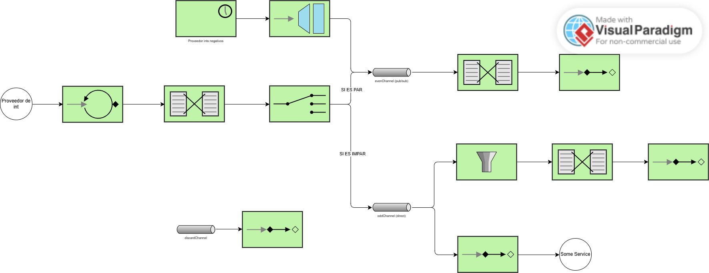

# Lab 5 Integration and SOA - Project Report

## 1. EIP Diagram (Before)

**Description of starter code behavior:**

The starter code had a flawed integration flow with several critical issues. The main flow polled an `AtomicInteger` source every 100ms, generating sequential numbers starting from 0. These numbers were routed through a content-based router to either `evenChannel` or `oddChannel` based on their parity. However, the implementation contained three significant bugs that prevented correct message processing:

1. Messages from the polling source went directly to the router without a proper intermediate channel
2. The odd channel had an incorrect filter that rejected odd numbers (checking `p % 2 == 0` instead of `p % 2 != 0`)
3. The Gateway injected messages into `evenChannel` instead of feeding them into the main routing logic

These issues caused odd numbers to be filtered out incorrectly, and gateway messages bypassed the router entirely, always being treated as even numbers regardless of their actual value.

---

## 2. What Was Wrong

### **Bug 1: Missing numberChannel for proper message flow separation**
- **Problem**: The original `myFlow` bean polled the `AtomicInteger` source and immediately routed messages. The Gateway also injected messages directly into `evenChannel`.
- **Why it happened**: The integration flow lacked a proper input channel (`numberChannel`) that both the polling source and the Gateway could send messages to, causing tight coupling and bypassing the router for gateway messages.
- **How I fixed it**: 
  - Created a separate `integerProducer` flow that polls the `AtomicInteger` source and sends messages to `numberChannel`
  - Modified `myFlow` to consume from `numberChannel` instead of polling directly
  - Changed the Gateway's `requestChannel` from `evenChannel` to `numberChannel`
  - This ensures all messages (from both sources) flow through the same router

### **Bug 2: Incorrect filter logic in oddFlow**
- **Problem**: The odd channel had a filter checking `p % 2 == 0`, which passes only even numbers and rejects odd ones—the opposite of what should happen.
- **Why it happened**: Logic error in the filter predicate; it was checking for even numbers on the odd channel.
- **How I fixed it**: Completely removed the filter from `oddFlow` since the router already ensures only odd numbers reach the odd channel. The filter was redundant and incorrectly implemented. Alternatively, it could have been fixed to `p % 2 != 0`, but removal was cleaner.

### **Bug 3: Wrong channel declaration**
- **Problem**: The bean `evenChannel()` was declared as a `PublishSubscribeChannelSpec`, but `oddChannel` was referenced without being declared as a bean.
- **Why it happened**: Inconsistent channel configuration; Spring Integration auto-creates missing channels, but explicit declaration is better for pub-sub semantics.
- **How I fixed it**: Changed the bean name from `evenChannel()` to `oddChannel()` to explicitly declare the odd channel as publish-subscribe, allowing multiple subscribers (the oddFlow transformer/handler chain and the SomeService ServiceActivator) to receive messages concurrently.

---

## 3. What You Learned

Through this lab, I gained practical understanding of Enterprise Integration Patterns and their implementation in Spring Integration:

**Key learnings:**
- **Channel separation**: Proper message flow design requires explicit channels to decouple message sources from processors. The `numberChannel` acts as a central point where multiple message sources converge before routing.
- **Content-Based Router**: Understanding how routers direct messages to different channels based on message content (even/odd logic), and why filters become redundant when routing is correct.
- **Publish-Subscribe Channel**: Learning when to use pub-sub channels (when multiple consumers need the same message) versus point-to-point channels.
- **Spring Integration DSL**: The Kotlin DSL provides a fluent way to define integration flows, but requires careful attention to channel names, bean definitions, and flow connectivity.

**Challenges:**
The most challenging aspect was tracing the message flow through multiple channels and understanding why gateway messages behaved differently from polled messages. Debugging required mentally simulating the message paths and identifying where messages were lost or misrouted. Creating the EIP diagram before fixing the code helped visualize these issues clearly.

---

## 4. AI Disclosure

**Did you use AI tools?** NO

---

## Additional Notes

The refactored code demonstrates better separation of concerns:
- **Producer responsibility**: `integerProducer` flow handles message generation
- **Gateway responsibility**: `SendNumber` interface injects external messages
- **Router responsibility**: `myFlow` handles all routing logic
- **Consumer responsibility**: Separate flows for even/odd processing

This architecture is more maintainable and follows EIP best practices by clearly defining each component's role in the integration flow.